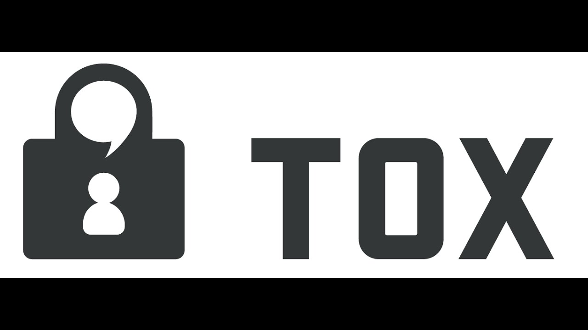

            
                              
Um chat de voz e texto para jogadores que é gratuito, seguro e que funciona tanto no celular quanto no computador. Pare de pagar por servidores TeamSpeak e de se incomodar com o Skype. Facilite sua vida.

As vantagens de você utilizar o Discord e por ele ser muito leve tanto para computador e para o celular, tem uma qualidade de som e comunicação melhor do que outros.

As desvantagens e que muitas vezes o aplicativo trava do nada.

Outro que também a um software livre e o TOX.

As vantagens por esse lado, o Tox , ele e muito bom para a comunicação para áudio e não tem publicação.

As desvantagens dele e por ainda não ter sido concluido , então ainda encontra-se alguns bugs dentro dele.

